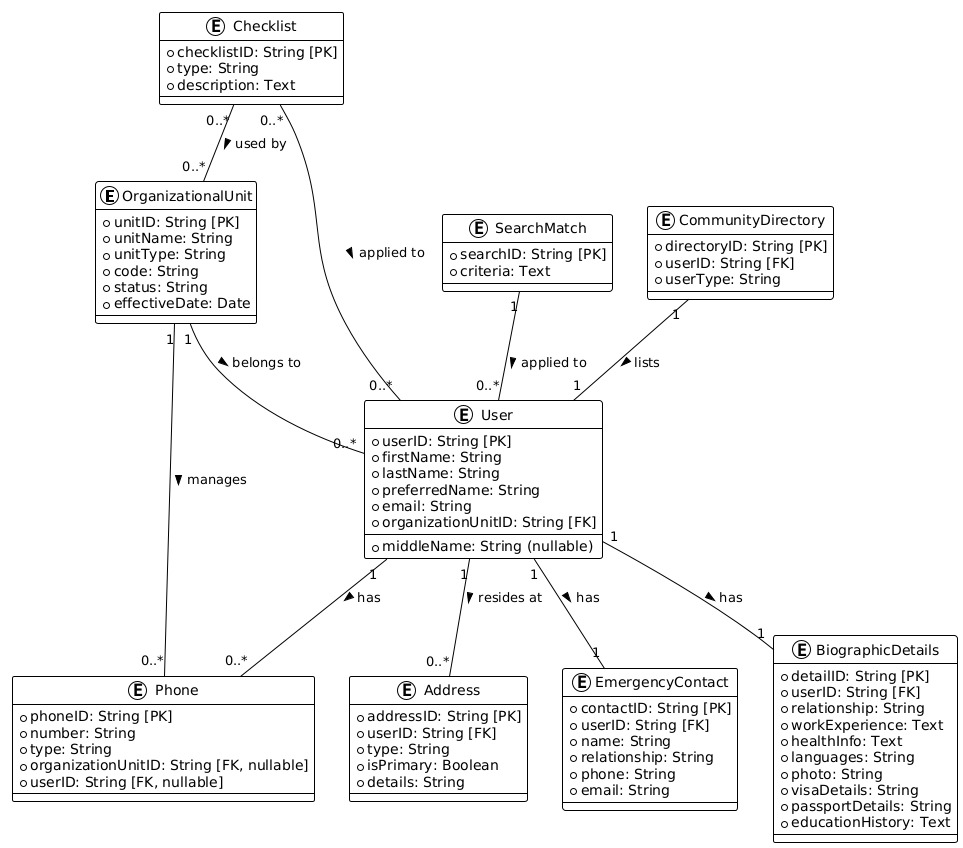

# PersonaConnect  
**Effortlessly Manage People, Data, and Organizations**  

[](./LICENSE)  
[](https://www.oracle.com/java/)  
[](https://www.mysql.com/)  

## 🌟 Overview  
**PersonaConnect** is a powerful database-driven application designed to centralize the management of users, organizational units, and related data. Built with **Java Swing** for an intuitive frontend and a meticulously crafted **MySQL database**, this project simplifies complex organizational data structures with style and efficiency.  

From handling biographic details to managing emergency contacts and checklists, **PersonaConnect** bridges the gap between data and usability for modern organizations.  

---

## 🔥 Features  
- **User Profiles**: Comprehensive user management with support for biographic details and emergency contacts.  
- **Organizational Units**: Define, categorize, and manage hierarchical units seamlessly.  
- **Checklist Tracking**: Monitor and manage task progress by organizational units.  
- **Community Directory**: Maintain role-specific user directories for better collaboration.  
- **Search Matching**: Enable filtered data views with dynamic search criteria.  
- **Stylish Interface**: Responsive and user-friendly Java Swing-based UI.  

---

## 📂 Entity-Relationship Diagram (ERD)  
A well-structured ERD connects the database tables for optimized data integrity and scalability.  
  

---

## 🛠️ Tech Stack  
### Backend  
- **MySQL**: High-performance relational database.  
- **Database Schema**: Fully normalized with relationships and constraints.  

### Frontend  
- **Java Swing**: Aesthetic and interactive GUI.  

### Tools  
- **GitHub**: Version control and collaboration.  
- **NetBeans/IntelliJ**: IDEs for Java development.  

---

## 🛠️ Installation & Setup  
### Prerequisites  
- MySQL Server (5.7+ recommended)  
- Java JDK (11 or higher)  
- IDE with Swing support (e.g., NetBeans, IntelliJ IDEA)  

### Steps  
1. Clone the repository:  
   ```bash
   git clone https://github.com/saadhtiwana/PersonaConnect.git
   cd PersonaConnect
Import the MySQL schema:
Execute the provided SQL script to set up the database.
Configure the database connection in the Java application.
Compile and run the Java Swing application from your IDE.
📖 Database Schema Highlights
Core Tables
User_: User profiles and organizational affiliations.
OrganizationalUnit: Metadata and hierarchy for organizational units.
Checklist: Tracks tasks and progress.
BiographicDetails: User-specific details like work experience and education.
EmergencyContact: Vital contact information for emergencies.
Relationships
Users ↔ Organizational Units: One-to-Many.
Users ↔ Biographic Details: One-to-One.
Users ↔ Emergency Contacts: One-to-Many.
📜 License
This project is licensed under the MIT License. See the LICENSE file for details.

🤝 Contributing
We welcome contributions!

Fork this repository.
Create a new branch: git checkout -b feature/YourFeature.
Commit your changes: git commit -m "Add feature: YourFeature".
Push to the branch: git push origin feature/YourFeature.
Open a pull request on GitHub.
📧 Contact
Saad Tiwana

GitHub: saadhtiwana
Email: saadhayat799@gmail.com
